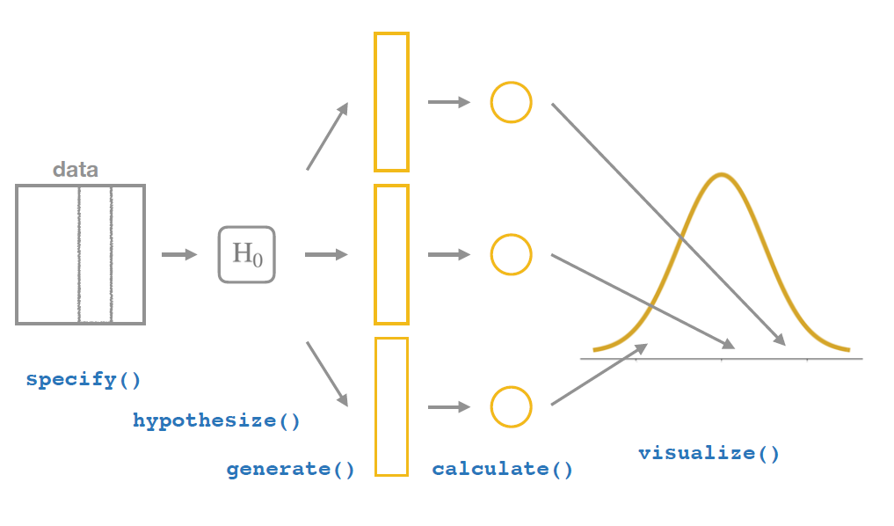

```{r setup, include=FALSE}
options(htmltools.dir.version = FALSE)
```


# What was the conference about really?

--
.center[

]


---

# Tidy Session Topics

--

- [Tidy spatial data analysis](https://github.com/edzer/rstudio_conf), [Edzer Pebesma](https://github.com/edzer)


- [The future of time series and financial analysis in the tidyverse](https://github.com/business-science/presentations/tree/master/2018_02_02_rstudio-conf-2018/presentation), [Davis Vaughan](https://github.com/DavisVaughan?tab=repositories), [@dvaughan32](https://twitter.com/dvaughan32)


- [infer: a package for tidy statistical inference](http://bit.ly/2DYoBOz), [Andrew Bray](http://infer.netlify.com/)


- [Tidying up your network analysis with tidygraph and ggraph](https://www.data-imaginist.com/slides/rstudioconf2018/assets/player/keynotedhtmlplayer#0), [Thomas Lin Pedersen](https://github.com/thomasp85), [@thomasp85](https://twitter.com/thomasp85)


- [The lesser known stars of the tidyverse](https://github.com/robinsones/rstudio-conf-2018-talk), [Emily Robinson](https://robinsones.github.io/), [@robinson_es](https://twitter.com/robinson_es)

--

- [Augmenting data exploration with interactive graphics](https://talks.cpsievert.me/20180202), [Carson Sievert](http://cpsievert.me/), [@cpsievert](http://twitter.com/cpsievert/)


- [tidycf: Turning analysis on its head by turning cashflows on their sides](https://github.com/emilyriederer/references/blob/master/tidycf_Riederer_rstudio.pdf), [Emily Riederer](https://popup.dominodatalab.com/chicago/speakers/emily-riederer/)


- [Modeling in the tidyverse](https://github.com/topepo/rstudio-conf/tree/master/2018/Modeling_in_the_Tidyverse--Max_Kuhn), [Max Kuhn](https://github.com/topepo)

--

For info about other sessions: [rstudio::conf 2018 Talks & Training Sessions](https://github.com/simecek/RStudioConf2018Slides)


---

# Tidy Spatial Data Analysis 

## Package `sf` features

--
- `sf` objects extends the `data.frame` or `tbl_df` with a geometry list-column

- speeds up geometrical operations by using spatial indexes created on-the-fly 

- simple and small API

- introduces `dplyr` verb methods for sf objects

---

# Tidy Spatial Data Analysis

##geom_sf

```{r tidy1, message=FALSE, warning=FALSE, echo = TRUE, fig.height=3}
library(ggplot2) # install_github("tidyverse/ggplot2")
library(sf)

nc = st_read(system.file("shape/nc.shp", package="sf"), quiet = TRUE)

ggplot(nc) + geom_sf(aes(fill = SID79))

```
---

# Future of Timeseries in Tidyverse


**`tibletime`** is an extension of the tidyverse that allows for the creation of time-aware **tibbles** through the setting of a **time-index** column.

--

```{r, message=FALSE, warning=FALSE}
library(tibbletime)
library(dplyr)

# Facebook stock prices. Comes with the package
data(FB)

# Convert FB to tbl_time
FB <- as_tbl_time(FB, index = date)
head(FB,5)
```
---
# Future of Timeseries in Tidyverse

`filter_time`: Use a concise filtering method to filter a tbl_time object by its index.

```{r, eval=FALSE, message=FALSE, warning=FALSE}
# Filter for dates from March 2013 to December 2015
FB %>% 
  filter_time("2013-03" ~ "2015")

# Filter for dates in 2015
FB %>% 
  filter_time(~"2015")

# Filter for dates from the start of the timeseries to Dec 2012
FB %>% 
  filter_time("start" ~ "2013-12")

```
---

# Future of Timeseries in Tidyverse

`collapse_by` : Collapse the index so that all observations in an interval share the same date. Useful for grouping

```{r, message=FALSE, warning=FALSE}

FB %>%
  select(-symbol) %>%
  collapse_by("monthly") %>%
  group_by(date) %>%
  summarise_all(mean) %>%
  top_n(5)

```
---

# Future of Timeseries in Tidyverse

`rollify` : returns a rolling version of the input function, with a rolling `window` specified by the user.

```{r, message=FALSE, warning=FALSE}

# Perform a 5 period rolling average
mean_5 <- rollify(mean, window = 5)
mutate(FB, roll_mean = mean_5(adjusted))

```
---

# **infer** an R package for tidy statistical inference

--

- makes statistical inference tidy and transparent

- dataframe in, dataframe out 

- compose tests and intervals with pipes

- unite computational and approximation methods

- reading an infer chain describes an inferential procedure

---

# Simulation through Permutation




---
```{r, message=FALSE, warning=FALSE, fig.height=4}
library(infer)
library(tidyverse)
load("gss.Rda")

gss %>%
  specify(NASA ~ party) %>%
  hypothesize( null = "independence")%>%
  generate( reps = 5000, type = "permute") %>%
  calculate(stat = "Chisq") %>%
  visualize()
```
---

# Tidying up your network analysis
--

## `tidygraph`: 

- `dplyr` verbs for working with network data except `do()` and `summarise()`

- "Tidyfication" of algortihms provided by `igraph`

- Unified API for all relational data structures

--

## `ggraph`

- Adoption of replational data to ggplot2

- Dedicated `geoms` for nodes and edges

- New faceting, guides, themes ...

---

# The Lesser Known &star;s of the Tidyverse
--

- `dplyr::na_if` - convert an annoying value to NA

--

- `tibble::tribble` - Create tibbles using an easier to read row-by-row layout

--

- `dplyr::select_if` - selection of variables. Ex: `is.numeric` to get numeric columns

--

- `skimr::skim` - gives set of summary functions based on the types of columns in the data frame

--

- `tidyr::unnest` - makes each element of the list its own row

--

- `forcats::fct_reorder` - reordring your factor positions

--

- `forcats::fct_relevel` - allows you to move any number of levels to any location

--

- `reprex::reprex` - make it easy to share a small reproducible example ("reprex")

---

class: center, middle

# Thank You!

